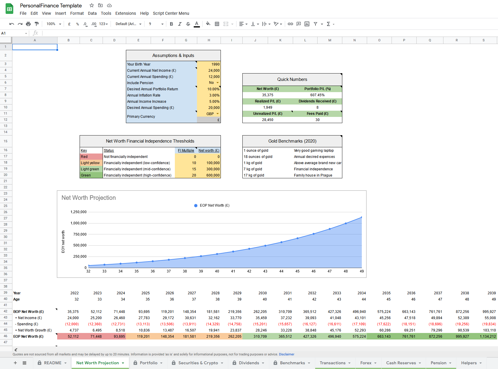
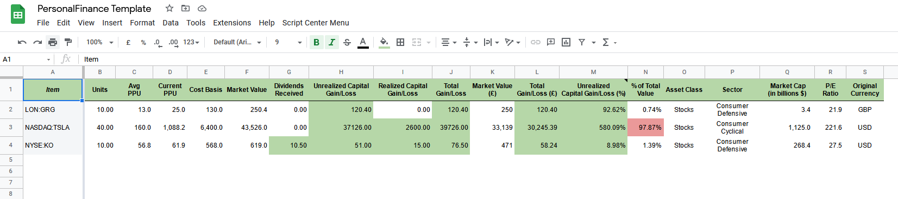
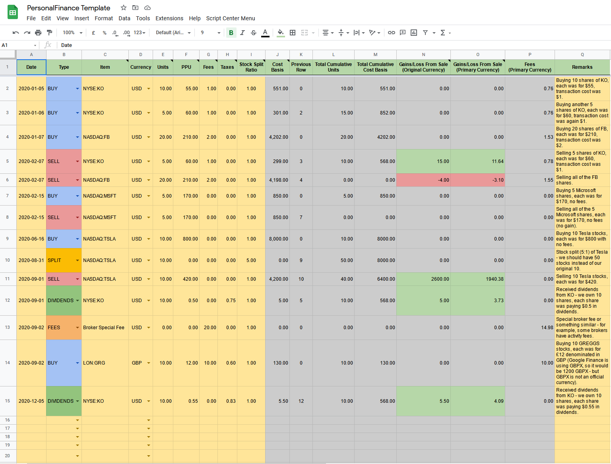

# Portfolio Insights Scripts

This repository stores scripts that I use for my personal finance needs - they are
part of a bigger project that I started in 2021 and is currently implemented on
Google Sheets.

## Run Locally

If you want to run the script locally, including installation
of all dependencies, you can create and activate virtual env and install
all necessary libraries: `./setup.sh`

Then run one of the main CLI scripts on the top-directory level.
Each of them implements parameter `--help`.

## Brokerage Report Parsing

The goal of most of the scripts in this repository is to process and reshape the reports exported
from a brokerage accounts I use into a consumable way that could be imported into the main tool,
the Personal Finance Google Sheet (see below). This tool is driven by a few input sheets;
the most important one is called *Transactions* and most of the calculations are based on it.

My typical flow is the following:

1. Log into each brokerage account I use and manually export activity statements from recent time period.

1. Run the script `statement_runner.py` and provide the statements exported from the previous step.

1. Copy-paste resulting data from the previous step into the main tool's sheet *Transactions*.

### Supported Platforms

Scripts implemented in this repository load, re-shape and enhance the data into a way that it's consumable
by the main tool. The input data is always a directory with the report statement(s), manually exported directly from
a given platform. It's usually one or more CSV files per brokerage/platform.

Supported platforms:

* Coinbase
* Coinbase Pro
* IBKR (todo generate reports again! check STOR from 2021 and CDR dividends from 2021-06-08)
* Revolut

## Personal Finance Google Sheet

The motivation here is to have a unified view on an individual's personal finances using
a tool that is fully open-sourced, free, and doesn't establish a direct connection to
your brokerage systems.

This functionality is especially useful if you use multiple brokers/platforms and your
portfolio is diversified across many asset categories such as stocks, crypto, gold, cash reserves,
etc. Furthermore, it supports many practical features, but more on that later.

### How It Started?

In 2020, I come across a book titled *The Richest Man in Babylon (by George S. Clason)* and it blew my mind.
Later that year, I told myself that I have to start investing and take personal finances more seriously.
Next year I bought a lots of books and started educating myself during evenings and weekends. You can
find some of my notes from this journey [here](https://lsulak-deployed-notes.s3-eu-west-1.amazonaws.com/investing.pdf).

Anyway, as I actually started with investing on the capital markets and my portfolio was more and more
diversified across many asset classes, brokerages and platforms, I wanted to have a centralized way
for viewing the overall portfolio. I was looking for something open-sourced, free & community driven,
with certain features I wanted. I couldn't find a product that would fully satisfy me so I created a
solution myself, tailored to my own needs.

It's just a **Google Sheets document** (for now, maybe I'll rewrite it to something more robust), publicly available
[here](https://docs.google.com/spreadsheets/d/1j-MRajHPs00mB3snLUEiYbVaY4v9_jb3mU_A1mn83sM).
Feel free to use it.

It's primarily driven by transactions (i.e. Buy, Sell, Dividends, Fees, Stock Split). I was manually entering
all individual transactions, in the past, but I wanted to automate this - ideally, without a direct API access
to the brokerage system. I wanted this to be completely isolated from my accounts.

### How It Works?

The tool has a couple of sheets. Some of them are presented below in the screens.
Half of the sheets represent user inputs, and the other half contain individual calculations
and pivot tables that are updated automatically based on the input data or various portals / finance APIs.

A user provides a set of inputs about his age, net worth, expected cash flow
from the monthly salary, expected and desired expenses, expected inflation
rate, and a few others, and the tool will project his future net worth and year when
he will be financially independent.

Other features include portfolio tracking through a lot of graphs and tables, portfolio
comparison against benchmarks (e.g. ETFs representing an index, such as S&P500 or QQQ),
dividend tracker, and much more. All world currencies are supported.

### Screenshots

See a few screenshots of the whole project below.

**An example of net worth assumptions, tracking, and future projection**

---

**An example of securities & crypto tracking**

---

**Most of the calculations are driven by a transaction log**

---

## Author

If you found this interesting, don't hesitate to reach out here:
<u><a href="mailto:laco.sulak@gmail.com">laco.sulak@gmail.com</a></u>.
